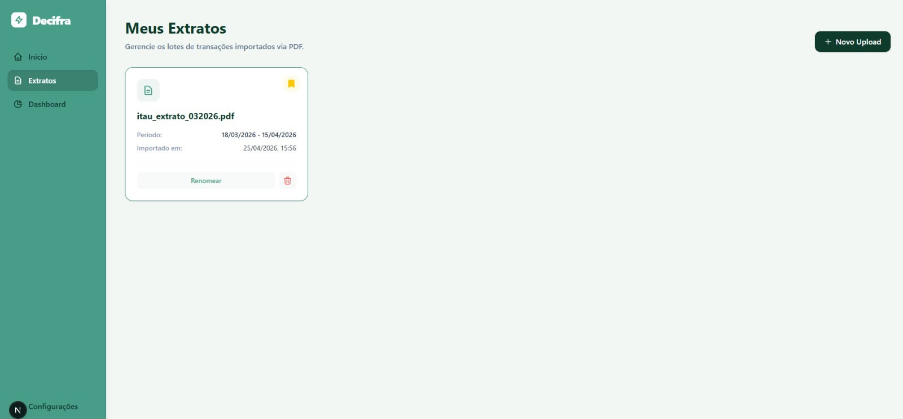
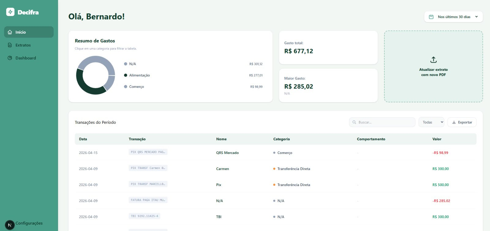
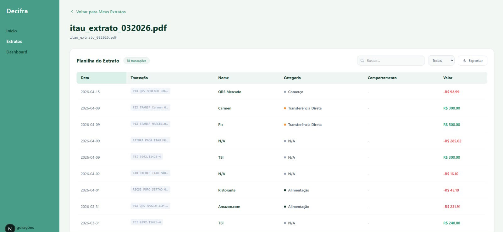
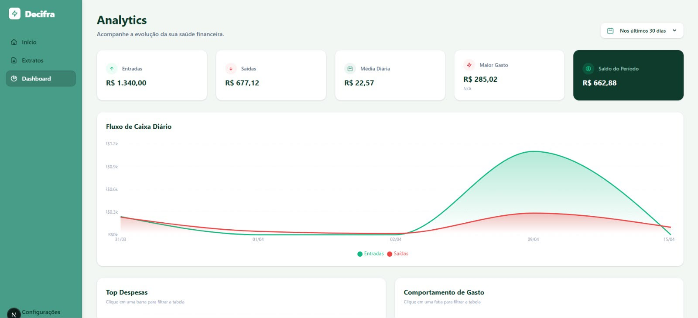
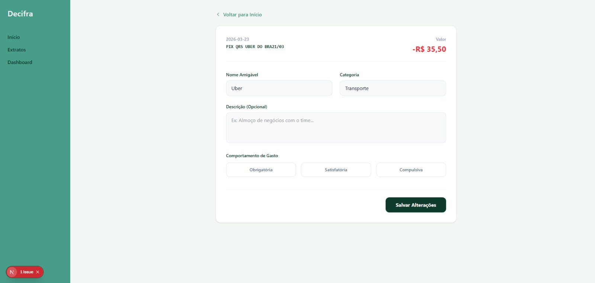

# 📄 Decifra | Plataforma Inteligente de Análise de Contratos

> Sistema full-stack focado na automação, gestão e análise de documentos jurídicos através de Inteligência Artificial (Ollama).

## 📖 Sobre o Projeto

O **Decifra** nasceu para resolver um problema comum em sistemas financeiros e aplicativos de finanças pessoais: faturas de cartão de crédito com nomes de estabelecimentos ilegíveis (ex: `PAG*PARME LGO DO MACHADO` ou `MP*UBER_LTDA`).

A plataforma atua como um tradutor inteligente, recebendo a string bruta da transação, interpretando o real nome do estabelecimento e o classificando automaticamente em categorias predefinidas (como Alimentação, Transporte, Lazer, etc.), retornando tudo em um formato JSON estruturado e pronto para uso no front-end ou em bancos de dados.

## 🛠 Tecnologias e Stack

- **Linguagem:** Java
- **Framework:** Spring Boot
- **Motor de Inteligência Artificial:** Ollama (rodando localmente em container `http://ollama:11434`).
- **Modelo LLM:** Google Gemma (`gemma:2b`), escolhido por ser leve, rápido e excelente para seguir instruções de formatação.

 ## Funcionalidades

- **Importação de Extratos:** Carregamento simples de arquivos PDF com o histórico de transações para processamento e leitura automática.
- **Visão Geral Mensal (Dashboard):** Painel inicial com o resumo de gastos do mês, destacando a maior despesa, totais e gráficos de distribuição por categorias (Alimentação, Transporte, Lazer, etc.).
- **Gestão de Lotes (Meus Extratos):** Área dedicada para salvar, visualizar, renomear e excluir os diferentes lotes de extratos já importados.
- **Edição e Personalização:** Caso seja necessário refinar o trabalho da IA, o usuário pode editar transações individualmente, alterando o "Nome Amigável", a "Categoria", adicionando "Descrições" e até classificando o "Comportamento de Gasto" (Obrigatória, Satisfatória ou Compulsiva).
- **Analytics Comparativo:** Uma aba aprofundada para acompanhar a evolução da saúde financeira, trazendo informações sobre fluxo de caixa diário (Entradas vs. Saídas) e top despesas em gráficos dinâmicos.

## 🧠 Como funciona a Inteligência Artificial (Engenharia de Prompt)

O coração do Decifra reside na classe `AiService.java`, onde a comunicação com o modelo local é configurada com técnicas avançadas de Prompt Engineering para garantir que a IA não "alucine" e sempre retorne dados consistentes:

1. **Definição de Persona e Restrições:** O prompt define explicitamente que o modelo é um "extrator de dados JSON estrito" e força a escolha entre categorias obrigatórias fechadas.
2. **Regras de Limpeza (Zero-Shot Guidance):** A IA é instruída a ignorar prefixos genéricos de adquirentes (`PAG*`, `MP*`) e sufixos empresariais ou de localização (`LTDA`, `SAO PAULO`), capturando apenas a marca fantasiada.
3. **Few-Shot Prompting:** Foram incluídos exemplos Input e Output no corpo do prompt para calibrar o comportamento da IA (ex: `'PAG*METRORIO_PASSAGEM'` --> `{"nomeAmigavel": "Metrô Rio", "categoria": "Transporte"}`).
4. **Temperatura Zero e Modo JSON:** O payload da requisição altera as configurações nativas do Ollama passando `"temperature": 0.0` para eliminar a aleatoriedade da geração de texto, e `"format": "json"` para assegurar que a resposta possa ser mapeada de volta no Java sem que a IA adicione textos como *"Aqui está o seu resultado"*.

## 🚧 Próximos Passos

Para evoluir a aplicação para um cenário de produção escalável, os seguintes pontos podem ser aprimorados:

- **Cache de Transações:** Implementar um sistema de cache (como Redis ou o próprio Spring Cache). Se uma transação como `PAG*UBER` já foi classificada antes, o sistema não precisaria chamar a IA novamente, poupando custo computacional.
- **Tratamento de Exceções Resiliente:** Melhorar o bloco `try-catch` para lidar de forma mais inteligente com _timeouts_ do Ollama, implementando Retries caso a API local falhe na primeira tentativa.
- **Mapeamento de Objetos (DTOs):** Criar classes Java DTO para desserializar a resposta automática, em vez de depender apenas do parse genérico via `Map<String, Object>`.
- **Testes Unitários:** Criação de testes com *Mock* da API do Ollama para garantir que a extração dos JSONs ocorra corretamente independente de a IA estar rodando.
- **Autenticação e Segurança:** Implementação de um sistema de login robusto para gestão de múltiplos usuários e controle granular de acesso a documentos sensíveis.
- **Persistência de Dados (Database & Storage):** Integração completa com o **Supabase** para o armazenamento seguro dos arquivos físicos (PDFs), banco de dados relacional e persistência de embeddings vetoriais.

## Imagens

  
  
  
  
  

